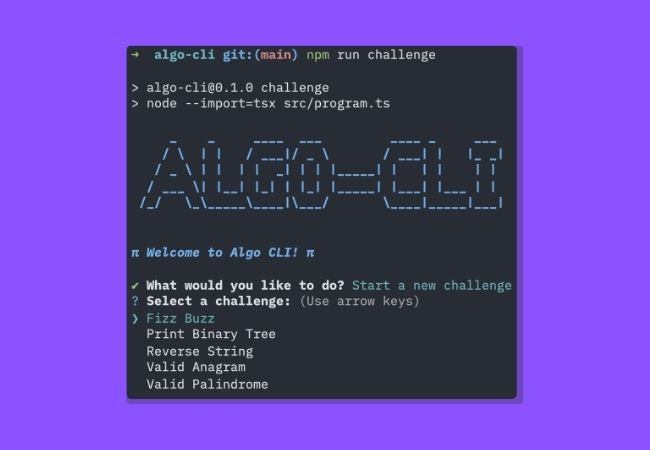
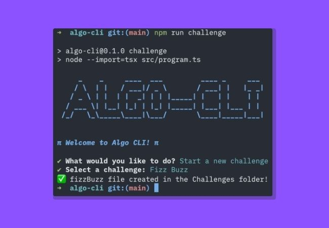
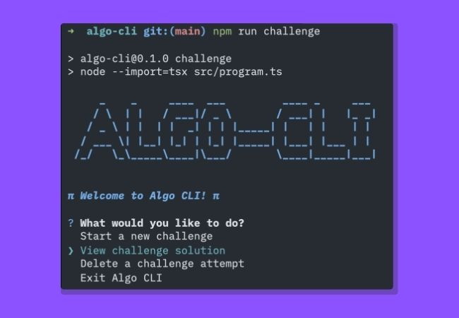
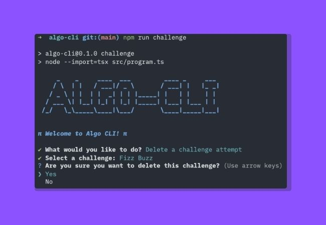
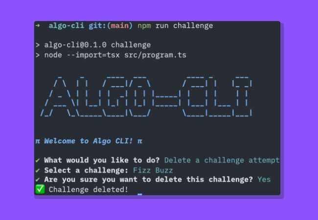
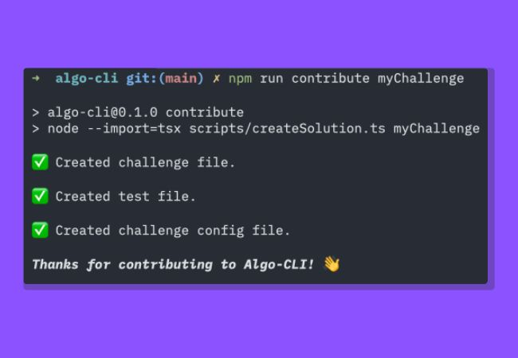

## Algo CLI


Tired of creating accounts, navigating to some other SaaS service? Train DSA locally, with your editor, your IDE, your key bindings, your styles! Algo CLI is a command-line tool designed to help you practice and implement algorithmic challenges in TypeScript in your own terminal.

### Features
- Modular challenge system (test your skills in `src/challenges/`)
- TypeScript-first codebase
- Simple CLI interface for running challenges
- Example challenges included FizzBuzz, Reverse String, Valid Anagram, etc. More to come each month!

### Project Structure

```
src/
	program.ts            # CLI entry point
	challenges/           # Algorithm challenges (your stuff lives here!)
		fizzBuzz.ts         # Example challenge
		index.ts						# Logic to work with challenges
		...
	solutions/            # Algorithm challenge solutions
		base.ts             # Base class for challenges
		fizzBuzz.ts         # Example challenge
		index.ts						# Logic to use solutions
		...
	static/               # Static data for challenges and some other stuff
test/
	src/challenges/       # Unit tests for challenges. They test both pre programmed solutions and your solutions.
utils/									# Utilitarian stuff for the CLI to run.
```

### Getting Started

1. **Clone repository:**
	 ```sh
	 git clone git@github.com:santiagoeid93/algo-cli.git
	 ```
2. **Install dependencies:**
	 ```sh
	 npm install
	 ```
3. **Run a challenge:**
	 ```sh
	 npm run challenge
	 ```
	 This will execute the CLI with the options menu.

### Starting a new Challenge
1. Execute the CLI program.
2. Select `Start a new challenge`.
3. Select one of the available challenges.
4. This will generate a challenge with the selected name in `src/challenges/` with some preset code and details regarding the requirements.
5. To test your solution, simply run `npm run test:challenge <yourChallengeName>`.





### Viewing a solution
1. Execute the CLI program.
2. Select `View challenge solution`.
3. Select one of the available challenges.




### Deleting a challenge attempt
1. Execute the CLI program.
2. Select `Delete a challenge attempt`.
3. Select one of the available challenges.

To exit the CLI, just select `Exit Algo CLI`.





### Testing your work

To run a suite of unit tests for a given challenge, just run:

`npm run test:challenge <fileName>`

You'll be able to know if you are in the right track using this, or if the criteria for the challenge has already been satisfied.


To test the actual solution, just run `npm run test:solution <fileName>`.

### Contributing
Feel free to contribute with your own algorithms!
1. Clone the repository and create a new contribution branch (eg. `git checkout -b <new-challenge-my-challenge>`).
2. Run `npm run contribute <challengeName>`. This will generate challenge solution, static json settings and test files.
3. Your challenge solution file will be created in `src/solutions/` (e.g., `myChallenge.ts`).
4. Extend the `BaseChallenge` class and implement the `solution` method.
5. Add your challenge to the CLI entry point (`src/program.ts`).
6. Fill out the `name`, `difficulty` and `problemSet` in the auto generated json file in `static/challenges/<yourChallenge>.json`.
7. Add unit tests for your challenge in `test/src/solutions/<yourSolution>.test.ts`.
8. Open a pull request with your changes.



#### Coding Guideline
- Use `camelCase` to name solution files.
- Use [Semver](https://semver.org/) for commits.
- Run `npm run lint` to make sure your code is up to spec with the guidelines before opening a PR.
- Use TypeScript and follow the existing code style.
- Place new challenge solutions in `src/solutions/` and tests in `test/src/solutions/`.
- Keep code modular and well-documented.
